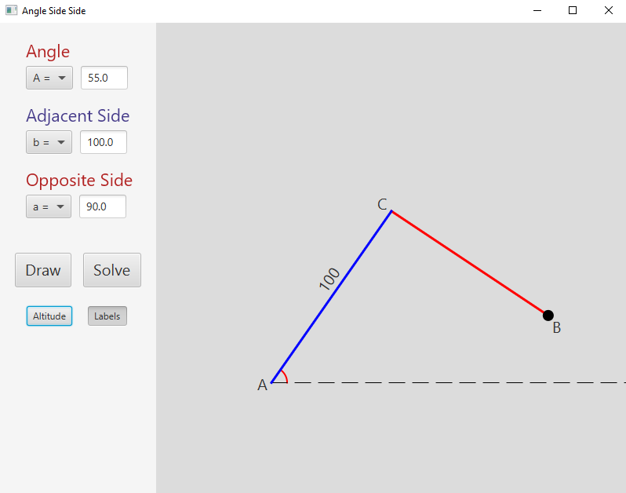
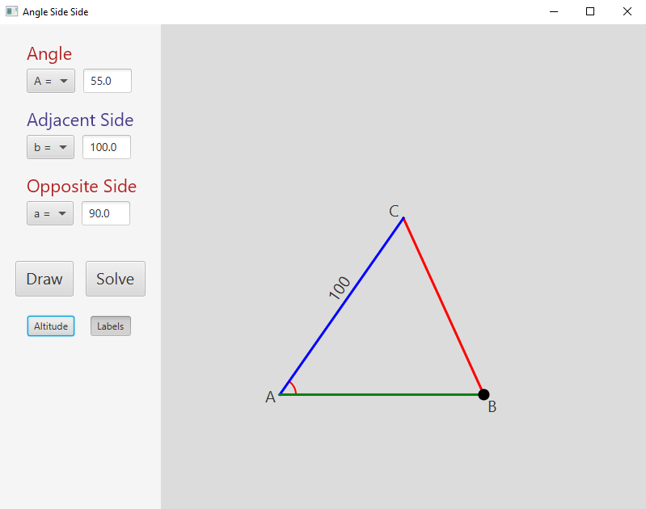
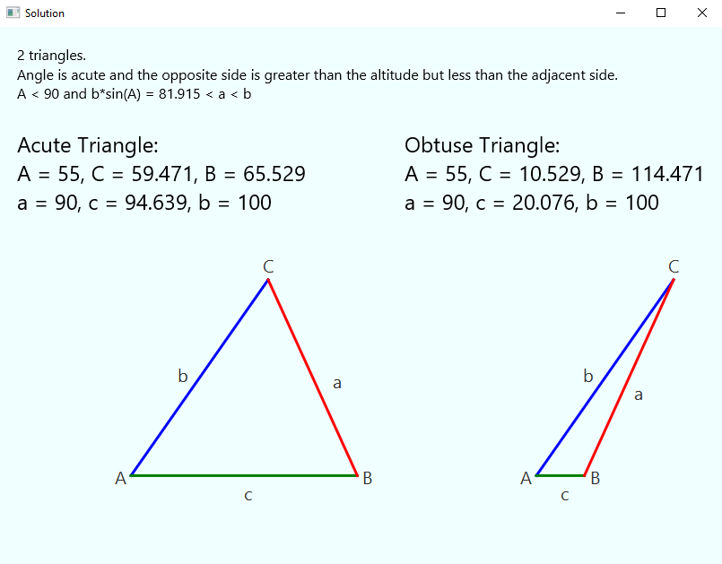

# ASS_Explorer

A fully featured Angle-Side-Side triangle explorer built with **Java** and **JavaFX**.





## Installation

Download the installer from the [Releases](https://github.com/DannyNagelMath/ASS_Explorer/releases) page, run it on Windows, and a desktop shortcut is created automatically. No JDK or JavaFX installation required.

## Features

- Enter any **angle**, **adjacent side**, and **opposite side** via the input panel to instantly render the triangle
- **Ambiguous case handling** — automatically determines 0, 1, or 2 triangle solutions using the Law of Sines, including right-triangle and altitude edge cases
- **Interactive swing arm** — drag the endpoint of the opposite side around its pivot to explore both solutions visually; solutions snap into place when the drag reaches them
- **Solve window** — opens a dedicated solution stage displaying a written diagnosis, all computed angles and side lengths, and a labeled triangle drawing for each solution
- **Altitude toggle** — show or hide the altitude line and right-angle marker
- **Labels toggle** — show or hide vertex labels (A, B, C) and side length labels on the diagram
- Flexible variable naming — use choice boxes to assign A/B/C and a/b/c to whichever angle and sides you prefer

## Tech Stack

| |                             |
|---|-----------------------------|
| Language | Java 21                    |
| UI Framework | JavaFX                      |
| Build & Packaging | Maven · jpackage · launch4j |

## Build from Source

Clone the repository:

```
git clone https://github.com/DannyNagelMath/ASS_Explorer.git
```

Open the project in IntelliJ IDEA. IntelliJ should automatically detect the `pom.xml` and import it as a Maven project. If prompted, click **Trust Project**.

JavaFX is bundled via Maven dependencies, so **no separate JavaFX installation is required**. However, you do need **JDK 21+** installed.

To run the app:
- **From IntelliJ:** Right-click `Runner.java` → **Run 'Runner.main()'**
- **From Maven:** Run `mvn clean javafx:run` in the terminal

## Project Structure

```
ASS_Explorer/
├── .mvn/wrapper/          # Maven wrapper support files
├── src/main/java/
│   ├── com/dannynagel/assexplorer/
│   │   ├── Runner.java        # Entry point; manages the main stage, input menu, and Draw/Solve buttons
│   │   ├── ASSInteract.java   # Interactive graphics pane; swing arm, drag events, and solution snapping
│   │   ├── ASSData.java       # Triangle math — Law of Sines solver, solution count, sides and angles
│   │   ├── ASSLabels.java     # Vertex and side-length labels positioned and rotated on the diagram
│   │   └── SolveStage.java    # Solution window — diagnosis text, computed values, and labeled triangle drawings
│   └── module-info.java       # Java module declaration
├── docs/                  # Screenshots and documentation assets
├── .gitignore
├── mvnw / mvnw.cmd        # Maven wrapper scripts (Windows and Unix)
└── pom.xml                # Maven build configuration
```

## License

This project is licensed under the MIT License. See the [LICENSE](LICENSE) file for details.
